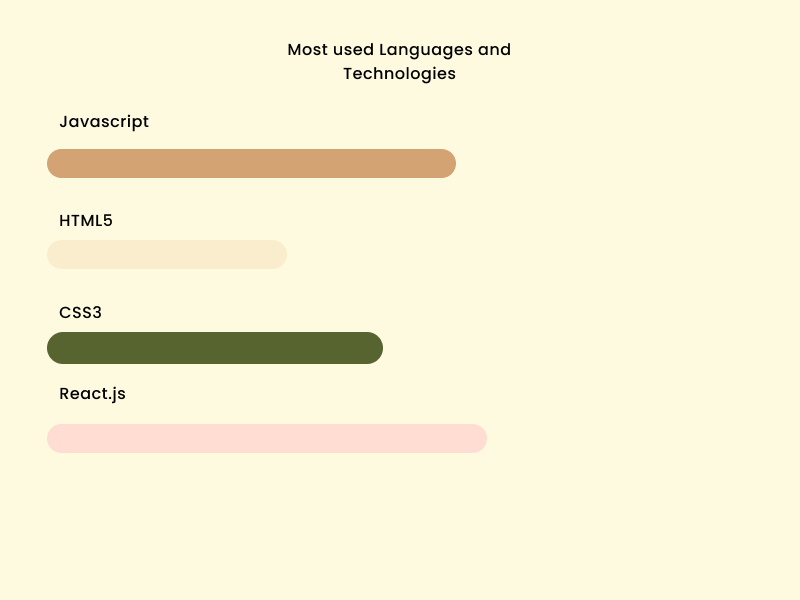

## Hi  !

 
 

Hi, I'm Matthew Oullanley Lee, a self-taught web developer and a student from indonesian. dreaming of becoming a good developer has been a dream for a long time and still on the way there. i always improve my skills, learn new technologies, and keep looking for opportunities for improve myself on many things. 

 

i learned a lot from the open-source community and i love how collaboration and knowledge sharing happened through open-source.

 
 

 

## Technologies which i use :

### Frontend Technologies

    
    
    
    
    
    

### Tools 

    
    
    

## Contact :
---
Phone Number : +62 82365366827
E-mail       : <a href = "mailto : matthew168lee88@gmail.com">Contact Me<a>

